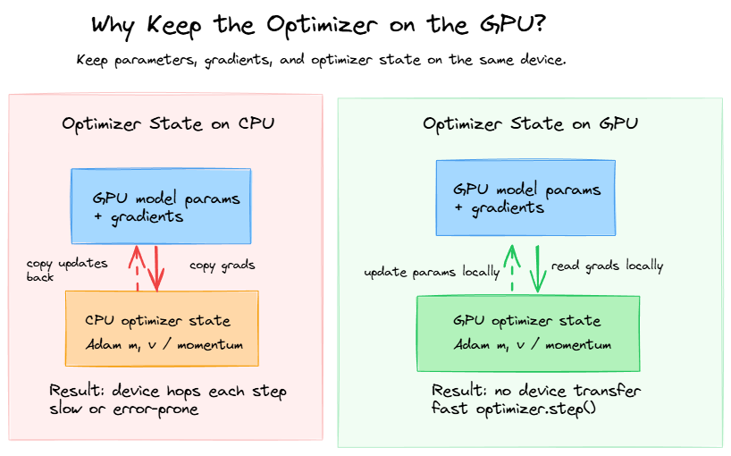
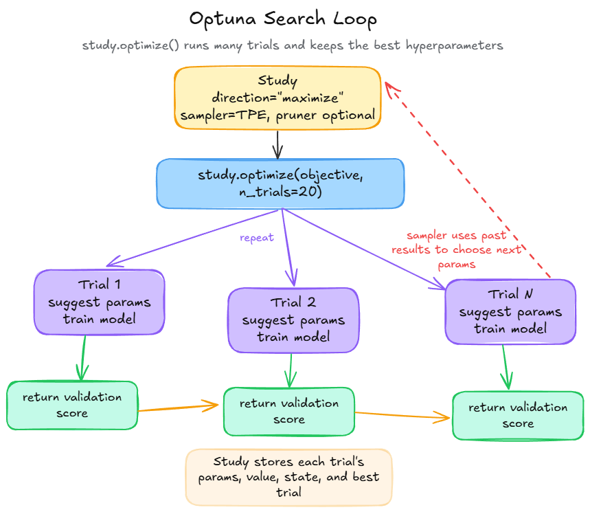
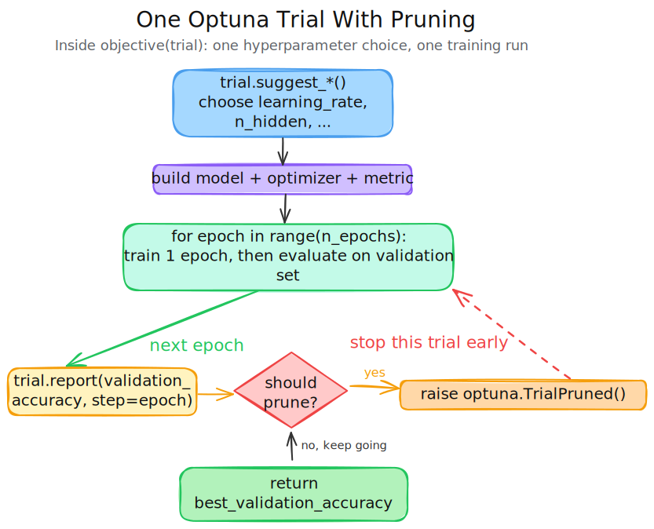
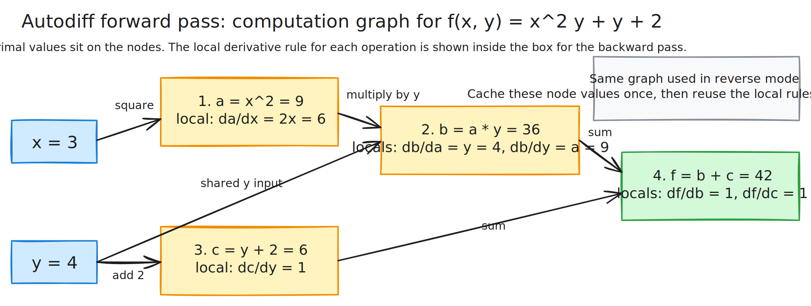
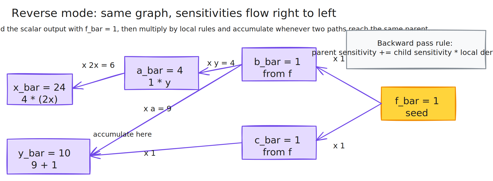

# Questions

## General

- [ ] Revise how backpropagation works in neural networks and make notes
  - [ ] Watch [Karphaty's Micrograd video](https://www.youtube.com/watch?v=VMj-3S1tku0&t=5971s)

## PyTorch

- [ ] Automatic differentiation and how it works in PyTorch
  - [x] Review appendix A
  - [ ] Go through appendix A notebook
- [ ] Computational graphs, what are they and how they are built in PyTorch
  - [ ] Create mini-differentiation engine as exercise

# Pick-up
- [x] Explore * unpacking 
- [x] Try debugger with PyTorch code
- [ ] For question on hyperparameter tuning, try Optuna on a small model and dataset and add database so that you can visualize the search history in the Optuna dashboard.
  - [ ] Try Marimo notebook for the exercise.
- [ ] Go through [Making Deep Learning go Brrrr](https://www.youtube.com/watch?v=WqLKfta5Ijw) and make notes

# Book Questions

## 2. What is the difference between methods ending in `_` and those without?

In PyTorch, methods ending in `_` are **in-place operations** — they modify the tensor directly without creating a new one.

**Without `_` (out-of-place):** Returns a new tensor, leaving the original unchanged.
```python
x = torch.tensor([1.0, 2.0, 3.0])
y = x.add(1)   # x is unchanged, y is a new tensor
```

**With `_` (in-place):** Modifies the tensor in memory, no new tensor is created.
```python
x = torch.tensor([1.0, 2.0, 3.0])
x.add_(1)      # x is modified directly → tensor([2., 3., 4.])
```

A few important caveats about in-place ops:

- **Autograd conflicts** — in-place ops can interfere with gradient computation. PyTorch will raise an error if you use them on tensors that are needed for backprop. Avoid them on tensors with `requires_grad=True`.
- **Memory efficiency** — the upside is they skip allocating a new tensor, which can matter with large tensors.
- **Common examples:** `zero_()`, `fill_()`, `relu_()`, `add_()`, `mul_()`, `copy_()`.

**Documentation:** The convention is explained in the PyTorch docs here:
👉 https://pytorch.org/docs/stable/notes/autograd.html#in-place-operations-with-autograd

## 12. What is the difference between `torch.jit.trace` and `torch.jit.script`?

`torch.jit.trace` goes through a model a few times with example inputs and records the operations it sees. It creates a static graph that can be optimized and run efficiently, but it only captures the operations that were executed during tracing. If your model has dynamic control flow (like `if` statements or loops that depend on input data), `torch.jit.trace` won't capture that logic correctly.

`torch.jit.script`, on the other hand, analyses the code of the model directly, and is able to handle dynamic behaviour. It can capture the full logic of the model, including control flow, but it requires that your code be written in a way that is compatible with TorchScript. This means you may need to avoid certain Python features or use special annotations.

- Requires *static types*, i.e needs to know that `x` is a `torch.Tensor` and not some arbitrary Python object, and that `x` has a certain shape and dtype. This can be a barrier for some dynamic models.

# Notes 

## Why do we move the optimizer to the GPU?

We keep the optimizer state on the GPU so it can update the model without crossing devices on every training step. Optimizers such as SGD with momentum and Adam store extra tensors, such as momentum buffers or first and second moment estimates. If the model parameters and gradients are on the GPU but the optimizer state is on the CPU, `optimizer.step()` either becomes slow because of repeated CPU-GPU transfers or fails with a device mismatch.

In practice, keeping everything on the same device means:

- the forward pass runs on the GPU
- the backward pass produces gradients on the GPU
- the optimizer reads those gradients on the GPU
- the optimizer updates the parameters on the GPU

That avoids unnecessary data movement and makes each training step much faster.

PyTorch nuance: you usually move the model to the GPU first, then create the optimizer. The optimizer object itself is not a module you call `.to(device)` on, but its internal state tensors must live on the same device as the parameters it updates.



## Optuna

Optuna is a hyperparameter search library. In this notebook, it automates the question: "which learning rate and hidden-layer size give the best validation accuracy?" Instead of trying values by hand, you define a search space and an evaluation function, and Optuna keeps launching experiments until it finds a strong configuration.




The main Optuna terms in this chapter are:

- **Study**: the whole optimization job. It stores all trials, their parameter values, their scores, and the best result seen so far.
- **Trial**: one full experiment. Optuna picks one set of hyperparameters, calls `objective(trial)`, and records the returned score.
- **Sampler**: the strategy that proposes the next hyperparameters. `TPESampler` uses previous trial results to bias future suggestions toward promising regions.
- **Pruner**: an early-stopping policy for bad trials. `MedianPruner` compares a trial's intermediate score to the median score of earlier trials at the same step.
- **Search space**: the allowed values for each hyperparameter, defined by calls such as `trial.suggest_float()` and `trial.suggest_int()`.

Here is what the first notebook version is doing:

```python
import optuna

def objective(trial):
  learning_rate = trial.suggest_float("learning_rate", 1e-5, 1e-1, log=True)
  n_hidden = trial.suggest_int("n_hidden", 20, 300)

  model = ImageClassifier(..., n_hidden1=n_hidden, n_hidden2=n_hidden, ...)
  optimizer = torch.optim.SGD(model.parameters(), lr=learning_rate)
  accuracy = torchmetrics.Accuracy(task="multiclass", num_classes=10).to(device)

  history = train2(model, optimizer, xentropy, accuracy, train_loader,
           valid_loader, n_epochs=10)
  return max(history["valid_metrics"])

study = optuna.create_study(direction="maximize", sampler=sampler)
study.optimize(objective, n_trials=5)
```

Read this code from the outside in:

1. `optuna.create_study(...)` creates a `Study` object. In this notebook, `direction="maximize"` means higher validation accuracy is better.
2. `study.optimize(objective, n_trials=5)` runs the `objective()` function 5 times.
3. Each time `objective(trial)` runs, Optuna creates a fresh `Trial` object and asks it to suggest hyperparameters.
4. `trial.suggest_float("learning_rate", 1e-5, 1e-1, log=True)` samples a learning rate between $10^{-5}$ and $10^{-1}$ on a log scale. That matters because learning rates usually vary by orders of magnitude, so values like `1e-4`, `1e-3`, and `1e-2` should all get a fair chance.
5. `trial.suggest_int("n_hidden", 20, 300)` samples an integer width for the hidden layers.
6. The sampled values are then used to build a new model, optimizer, and metric object for that trial.
7. `train2(..., n_epochs=10)` trains that one model for 10 epochs.
8. `max(history["valid_metrics"])` returns a single scalar score to Optuna. That number is the trial's objective value.

What this code generates:

- 5 complete training runs
- 5 trial records inside `study.trials`
- 5 parameter sets, such as `{"learning_rate": ..., "n_hidden": ...}`
- 5 objective values, one per trial
- one best trial, exposed through `study.best_params`, `study.best_value`, and `study.best_trial`

The object returned by `create_study()` is useful after optimization, not just during it. Common things to inspect are:

- `study.best_params`: the best hyperparameter combination found
- `study.best_value`: the best score found
- `study.trials`: the full history of all trials

The second notebook version adds pruning, which changes the structure a bit:



```python
def objective(trial, train_loader, valid_loader):
  learning_rate = trial.suggest_float("learning_rate", 1e-5, 1e-1, log=True)
  n_hidden = trial.suggest_int("n_hidden", 20, 300)

  model = ImageClassifier(...).to(device)
  optimizer = torch.optim.SGD(model.parameters(), lr=learning_rate)

  best_validation_accuracy = 0.0
  for epoch in range(n_epochs):
    history = train2(model, optimizer, xentropy, accuracy,
             train_loader, valid_loader, n_epochs=1)
    validation_accuracy = max(history["valid_metrics"])
    best_validation_accuracy = max(best_validation_accuracy,
                     validation_accuracy)

    trial.report(validation_accuracy, step=epoch)
    if trial.should_prune():
      raise optuna.TrialPruned()

  return best_validation_accuracy
```

This version has two nested loops, and it is important to keep them separate in your head:

- The **outer loop** is hidden inside `study.optimize(...)`. It runs one trial after another.
- The **inner loop** is `for epoch in range(n_epochs)`. It trains one specific trial for several epochs.

The pruning version calls `train2(..., n_epochs=1)` inside the epoch loop. That means each pass through the loop trains exactly one additional epoch, then checks the validation accuracy before deciding whether the trial is worth continuing.

The key pruning calls are:

- `trial.report(validation_accuracy, step=epoch)`: send the current intermediate score to Optuna.
- `trial.should_prune()`: ask the pruner whether this trial looks bad enough to stop early.
- `raise optuna.TrialPruned()`: stop the current trial immediately and mark it as pruned instead of completed.

Why return `best_validation_accuracy` instead of the most recent value? Because a model can peak earlier and then flatten or wobble. Returning the best validation score seen during the trial gives Optuna the strongest evidence for that hyperparameter setting.

The notebook also shows two ways to pass extra data loaders into the objective:

```python
objective_with_data = lambda trial: objective(
  trial, train_loader=train_loader, valid_loader=valid_loader)

from functools import partial

objective_with_data = partial(objective, train_loader=train_loader,
                valid_loader=valid_loader)
```

Both forms create a new callable that Optuna can call with just one argument, `trial`. `partial(...)` is usually cleaner because it names the fixed arguments explicitly.

The general Optuna pattern is:

```python
def objective(trial):
  params = {
    "learning_rate": trial.suggest_float("learning_rate", 1e-5, 1e-1, log=True),
    "n_hidden": trial.suggest_int("n_hidden", 20, 300),
  }

  model = build_model(params)
  score = train_and_evaluate(model, params)
  return score

study = optuna.create_study(
  direction="maximize",
  sampler=optuna.samplers.TPESampler(seed=42),
  pruner=optuna.pruners.MedianPruner(),
)
study.optimize(objective, n_trials=20)
```

That structure is the part to remember:

1. Define an `objective(trial)` function.
2. Use `trial.suggest_*()` inside it to define the search space.
3. Build and train the model using those sampled values.
4. Return one scalar score.
5. Create a study.
6. Call `study.optimize(...)`.
7. Read `study.best_params` and `study.best_value`.

One final mental model: Optuna does not train a single model better and better. It trains many separate models with different hyperparameters, compares them, and remembers which hyperparameters produced the best validation result.

## Torch Compile

Since PyTorch 2.0, `torch.compile()` is a new feature that can speed up a model's execution by optimizing the underlying code. It works by tracing the operations in your model and generating optimized code for them.

The main benefits of `torch.compile()` are:
  - **Fusion**: it can combine multiple operations into one, reducing overhead.
  - **Graph capture**: it can analyze the computation graph and optimize it globally.

Speedups are most noticeable when a large portion of the GPU is being used. This can be achieved by:
  - **Increasing the batch size** - More samples per batch means more samples on the GPU, for example, using a batch size of 256 instead of 32.
  - **Increasing data size** - For example, using larger image size, 224x224 instead of 32x32. A larger data size means that more tensor operations will be happening on the GPU.
  - **Increasing model size** - For example, using a larger model such as ResNet101 instead of ResNet50. A larger model means that more tensor operations will be happening on the GPU.
  - **Decreasing data transfer** - For example, setting up all your tensors to be on GPU memory, this minimizes the amount of data transfer between the CPU and GPU.
  
How to check available GPU memory:
```python
import torch

# Check available GPU memory and total GPU memory 
total_free_gpu_memory, total_gpu_memory = torch.cuda.mem_get_info()
print(f"Total free GPU memory: {round(total_free_gpu_memory * 1e-9, 3)} GB")
print(f"Total GPU memory: {round(total_gpu_memory * 1e-9, 3)} GB")
```

For my NVIDIA GeForce RTX 4070 Super, I get the following output:
```text
Total free GPU memory: 11.525 GB
Total GPU memory: 12.878 GB
```

### Using torch.compile()
To use `torch.compile()`, you simply wrap your model with it before training:

```python
# 1. Create model
model = ImageClassifier(n_inputs=784, n_hidden1=300, n_hidden2=100, n_classes=10).to(device)

# 2. Compile model (The Magic Line)
# 'reduce-overhead' is great for small/medium models, but not necessary
optimized_model = torch.compile(model, mode="reduce-overhead")

# 3. Train the optimized version
_ = train2(optimized_model, optimizer, xentropy, accuracy, train_loader , valid_loader, n_epochs)
```

**Tip**: When using `torch.compile()`, try to avoid "Graph Breaks." These happen when you put a `print()` statement or a non-PyTorch library (like scipy) right in the middle of your forward pass. Every time the compiler hits a `print()`, it has to "break" the optimized graph, go back to slow Python, and then restart the graph, which eats your performance gains.

Resources:
- [PyTorch 2.0 Quick Tutorial Video](https://www.youtube.com/watch?v=WqLKfta5Ijw)
- [Making Deep Learning go Brrrr](https://www.youtube.com/watch?v=WqLKfta5Ijw)

## Torch Autograd

`requires_grad=True` tells PyTorch to track all operations on that tensor so it can compute gradients later. When you call `.backward()`, PyTorch uses the recorded operations to calculate the gradient of the loss with respect to that tensor.

`from torch import autograd` is a way to import the `autograd` module directly, so you can use its functions directly. Most importantly, `autograd.grad()` allows you to compute gradients of tensors without needing to call `.backward()`, which can be useful for more complex gradient computations or when you want to compute gradients with respect to specific tensors.

When using `grad` the computation graph is destroyed after the call, freeing up memory. Use `retain_graph=True` if you need to call `grad` multiple times on the same graph (you will most likely not need this in practice, but useful for exercises).

## Autodiff with computation graphs

Autodiff sits between **numerical differentiation** and **symbolic differentiation**.

- **Numerical differentiation** perturbs the input a little (i.e., using $\epsilon$) and estimates the slope. It is simple, but approximate and often numerically unstable.
- **Symbolic differentiation** manipulates an expression like algebra and produces a new expression for the derivative.
- **Autodiff** breaks a function into small operations, stores them in a **computation graph**, and applies the chain rule exactly, one local step at a time.

The key idea is that a large derivative looks hard only when you stare at the whole formula at once. A computation graph turns it into many tiny derivatives that are easy:

- addition: local derivative is `1`
- multiplication: local derivative is “the other input”
- `sin`: local derivative is `cos`
- square: local derivative is `2x`

Autodiff just composes these local rules using the chain rule.

### Intuition: what a computation graph is doing

Think of a computation graph as a recipe with saved intermediate results. Each node stores one small operation, and each edge says “this value is used here next.”

Use the same example as in Appendix A:

$$
f(x,y) = x^2y + y + 2
$$

At $x = 3$ and $y = 4$ the graph evaluates like this:



The graph gives the model a place to store two kinds of information:

- the **primal values**: `a = 9`, `b = 36`, `c = 6`, `f = 42`
- the **dependency structure**: which earlier values each node depends on

That dependency structure is what makes autodiff efficient. We do not differentiate the whole formula from scratch for each variable. We reuse the graph.

### Forward-mode autodiff

Forward mode asks:

> If I nudge one input a little, how does that small change flow forward through the graph?

So forward mode propagates a value and its derivative together.

To compute $\dfrac{\partial f}{\partial x}$, seed the input derivatives with:

$$
\dot{x} = 1, \qquad \dot{y} = 0
$$

Now move left to right through the same graph:

1. $a = x^2$ so $\dot{a} = 2x\dot{x} = 2 \cdot 3 \cdot 1 = 6$
2. $b = ay$ so $\dot{b} = y\dot{a} + a\dot{y} = 4 \cdot 6 + 9 \cdot 0 = 24$
3. $c = y + 2$ so $\dot{c} = \dot{y} = 0$
4. $f = b + c$ so $\dot{f} = \dot{b} + \dot{c} = 24 + 0 = 24$

Therefore:

$$
\frac{\partial f}{\partial x} = 24
$$

To get $\dfrac{\partial f}{\partial y}$, run forward mode again with a different seed:

$$
\dot{x} = 0, \qquad \dot{y} = 1
$$

This gives:

$$
\dot{a} = 0, \qquad \dot{b} = 9, \qquad \dot{c} = 1, \qquad \dot{f} = 10
$$

So:

$$
\frac{\partial f}{\partial y} = 10
$$

The intuitive picture is: forward mode carries a little “sensitivity tag” with each value and keeps updating that tag as the value flows through the graph.

### Forward mode and symbolic differentiation

One clean way to implement forward mode is to make each node return a **new symbolic derivative expression**.

For the same graph, the derivative rules look like this:

- $\dfrac{d(x)}{dx} = 1$
- $\dfrac{d(y)}{dx} = 0$
- $\dfrac{d(a+b)}{dx} = \dfrac{da}{dx} + \dfrac{db}{dx}$
- $\dfrac{d(ab)}{dx} = a\dfrac{db}{dx} + \dfrac{da}{dx}b$

Apply these rules recursively and you do **not** just get a number. You get a new expression for the derivative. For example:

$$
\frac{\partial f}{\partial x} = \frac{\partial (x^2y + y + 2)}{\partial x} = 2xy
$$

In a toy autodiff engine, that derivative is often represented as **another computation graph**, not as plain text algebra.

That second graph is necessary because the derivative is itself a function. If you only kept the final numeric answer `24`, you would lose the structure needed to:

- evaluate the derivative at a different point
- differentiate again to get second derivatives
- reuse the derivative expression as part of a larger computation

So symbolic forward mode often works like this:

1. build the original computation graph for $f$
2. walk through it and build a second graph for $\dfrac{\partial f}{\partial x}$
3. evaluate that derivative graph at the chosen input values

In practice, forward mode is often implemented more efficiently using **dual numbers** or **JVPs** (Jacobian-vector products), which carry the derivative information numerically and avoid explicitly building a huge derivative graph. But conceptually, the symbolic-graph view makes it clear why the derivative must still preserve the same compositional structure as the original function.

### Reverse-mode autodiff (backward mode)

Reverse mode asks the opposite question:

> If the output changes by a tiny amount, how much did each earlier node contribute to that change?

Instead of pushing derivatives forward from one input, reverse mode pulls sensitivities backward from the output.

This is the mode used by backpropagation.

First do a normal forward pass and cache the intermediate values:

$$
a = 9, \qquad b = 36, \qquad c = 6, \qquad f = 42
$$

Then start the backward pass with:

$$
\bar{f} = \frac{\partial f}{\partial f} = 1
$$

Here the bar means “how sensitive the final output is to this node.”

Now move right to left:

1. From $f = b + c$, set $\bar{b} = 1$ and $\bar{c} = 1$.
2. From $c = y + 2$, add $\bar{c} \cdot 1 = 1$ to $\bar{y}$.
3. From $b = ay$, add $\bar{b} \cdot y = 1 \cdot 4 = 4$ to $\bar{a}$, and add $\bar{b} \cdot a = 1 \cdot 9 = 9$ to $\bar{y}$.
4. From $a = x^2$, add $\bar{a} \cdot 2x = 4 \cdot 6 = 24$ to $\bar{x}$.

So the final gradients are:

$$
\frac{\partial f}{\partial x} = 24, \qquad \frac{\partial f}{\partial y} = 10
$$

Here is the same backward flow as a diagram:



The intuitive picture is: reverse mode asks each node, “how much does the final output depend on you?”, and then hands that responsibility backward to the node’s parents.

### Why reverse mode is used for neural networks

In deep learning, the inputs to the loss are usually all the model parameters:

- thousands or millions of weights and biases
- one scalar output during training: the loss

That is exactly the setting where reverse mode is strongest. One forward pass plus one backward pass gives the gradient of the loss with respect to **all** parameters.

That is why backpropagation is best understood as:

- **forward pass**: compute activations and save what the backward pass will need
- **backward pass**: use reverse-mode autodiff to compute all gradients efficiently

### Summary

| Forward mode | Reverse mode |
|---|---|
| Few inputs, many outputs | Many inputs, few outputs |
| Propagate sensitivities forward | Pull sensitivities backward |
| Conceptually simple: one pass per input | Requires forward pass first to calculate values|
| To get the full gradients with respect to many inputs, you usually need one pass per input direction. | Can use a lot of memory, since activations often need to be cached for backpropagation. |
| Symbolic versions can create large derivative graphs or expression blow-up. | Less convenient than forward mode when you want the full Jacobian of many outputs. |


### Short mental model

- **Forward mode**: “push a tiny input change through the graph.”
- **Reverse mode**: “pull output responsibility back through the graph.”
- **Symbolic differentiation**: “build the derivative as another expression or graph.”
- **Backpropagation**: “reverse-mode autodiff used to train neural networks.”

